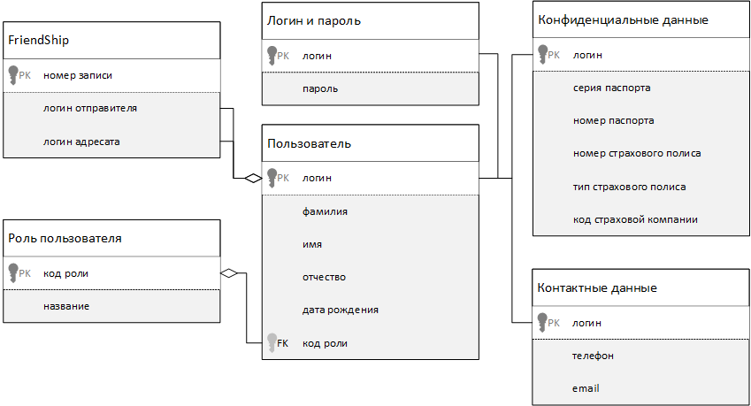

# Template WPF application
## Тема 
Корпоративная сеть.
## Структура сети
Сеть состоит из пользователей разных ролей, минимальный перечень ролей: модераторы (админы) и обычные пользователи. 
В данной сети пользователи могут добавлять друг друга в друзья, а также удалять из друзей.

## ERD диаграмма

## Минимальный функционал:
 - Модераторы могут просматривать пользовательские учетные данные;
 - Модераторы могут удалять/добавлять пользователей любых ролей;
 - Модераторы могут повышать/уменьшать роль пользователя;
 - Пользователи могут добавлять/удалять друзей;
 - Пользователи просматривают список друзей;
 - Пользователи применяют сортировку/фильтрацию/поиск к списку друзей для поиска нужного друга.
